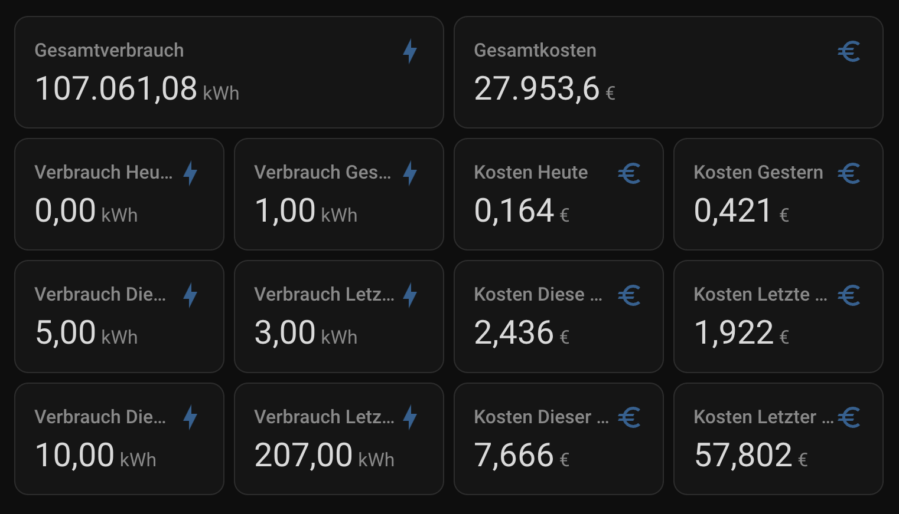
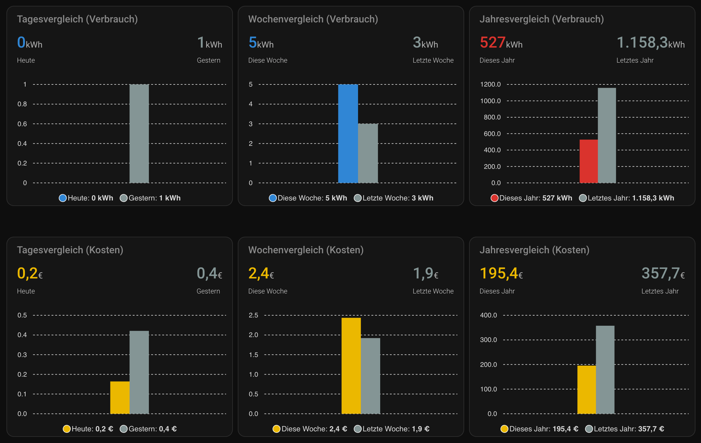

# Energierechner Home Assistant Integration

<p align="center">
  
</p>

Ein Home Assistant Port des [Energierechner Symcon Moduls](https://github.com/Schnittcher/Energierechner) zur Berechnung von Stromkosten mit dynamischen Tarifperioden, Tag-/Nachttarifen und flexibler Aggregation.

## Screenshots

<p align="center">
  
  
</p>

## Funktionen

- ✅ Mehrere Tarifperioden mit konfigurierbaren Preisen
- ✅ Tag-/Nachttarif-Trennung (konfigurierbare Zeiten)
- ✅ Grundpreisberechnung
- ✅ Bilanzberechnung (monatlicher Abschlag – tatsächliche Kosten)
- ✅ Zeitraum-Aggregation:
  - Täglich, Vortag
  - Wöchentlich (aktuell/vorherig)
  - Monatlich (aktuell/letzter)
  - Jährlich (aktuell/letztes)
  - Periodenweise (je Tarif)
- ✅ Flexibles Verbrauchs-/Kosten-Tracking (Tag/Nacht getrennt)
- ✅ **Neu:** PV-Einspeisung / Ertragstracking: Wähle im Setup zwischen Strombezug (Kosten/Verbrauch) und PV-Einspeisung (Vergütung/Ertrag).
- ✅ Jede Kennzahl (Kosten, Verbrauch, Bilanz) wird als **eigene physische Sensor-Entität** erstellt (optimal für Dashboards).
- ✅ Recorder-basierte Verlaufsauswertung
- ✅ Einrichtung über die **Home Assistant UI** (kein YAML nötig)

## Installation

### HACS (empfohlen)

1. HACS → Integrationen → ⋮ → **Benutzerdefinierte Repositories**
2. URL: `https://github.com/PowderK/Energierechner-HA` · Kategorie: **Integration**
3. „Energierechner" suchen und installieren
4. Home Assistant neu starten

### Manuelle Installation

1. Dieses Repository klonen
2. `custom_components/energierechner/` in das HA-Verzeichnis `config/custom_components/` kopieren
3. Home Assistant neu starten

## Einrichtung

Nach dem Neustart:

**Einstellungen → Integrationen → + Hinzufügen → „Energierechner"**

Der dreistufige Assistent führt durch:
1. **Grundkonfiguration** – Sensorname, kWh-Quelle, Aktualisierungsintervall
2. **Funktionen** – Aktivierung von Tag-/Nachttarif, Zeiträumen (heute, Woche, Monat…), Bilanz
3. **Setup-Menü (Tarifperioden)** – Hier fügst du über den Button **"+ Neue Tarifperiode anlegen"** bequem über ein Formular (Datum, Preise, Zeiten) deine Tarife hinzu. Danach auf "Speichern & Beenden" klicken.

*(Einstellungen können nachträglich jederzeit über **Konfigurieren** im selben Menü angepasst, bearbeitet oder gelöscht werden.)*

## Sensor-Entitäten & Dashboard

Die Integration erzeugt für jeden aktivierten Zeitraum separate Sensoren für **Kosten (€)** und **Verbrauch (kWh)** unterhalb eines gemeinsamen Gerätes.

*(Beispiel: Wenn der Name in der UI "Strom" lautet, heißen die Entitäten `sensor.strom_heute_kosten` und `sensor.strom_heute_verbrauch`).*

### Beispiel-Karten fürs Dashboard (Grid / Übersicht)

Hier sind zwei vorgefertigte YAML-Codes für eine schöne, getrennte Übersicht im HA-Dashboard (ersetze ggf. `energierechner` durch deinen gewählten Sensornamen). Die aktuelle Periode und die Vorperiode stehen hierbei für den direkten Vergleich (Heute vs Gestern) sofort lesbar nebeneinander.

**Kachel 1: Übersicht Verbrauch**
```yaml
type: vertical-stack
cards:
  - type: entity
    entity: sensor.energierechner_gesamtverbrauch
    name: Gesamtverbrauch
    icon: mdi:lightning-bolt
  - type: grid
    columns: 2
    square: false
    cards:
      - type: entity
        entity: sensor.energierechner_heute_verbrauch
        name: Verbrauch Heute
      - type: entity
        entity: sensor.energierechner_gestern_verbrauch
        name: Verbrauch Gestern
      - type: entity
        entity: sensor.energierechner_aktuelle_woche_verbrauch
        name: Verbrauch Diese Woche
      - type: entity
        entity: sensor.energierechner_vorherige_woche_verbrauch
        name: Verbrauch Letzte Woche
      - type: entity
        entity: sensor.energierechner_aktueller_monat_verbrauch
        name: Verbrauch Dieser Monat
      - type: entity
        entity: sensor.energierechner_letzter_monat_verbrauch
        name: Verbrauch Letzter Monat
  # Natives Balkendiagramm (Verlauf der letzten 7 Tage)
  - type: statistics-graph
    title: Verbrauch (Letzte 7 Tage)
    chart_type: bar
    period: day
    days_to_show: 7
    stat_types:
      - change
    entities:
      - sensor.energierechner_gesamtverbrauch
```

**Kachel 2: Übersicht Kosten**
```yaml
type: vertical-stack
cards:
  - type: entity
    entity: sensor.energierechner_gesamtkosten
    name: Gesamtkosten
    icon: mdi:currency-eur
  - type: grid
    columns: 2
    square: false
    cards:
      - type: entity
        entity: sensor.energierechner_heute_kosten
        name: Kosten Heute
      - type: entity
        entity: sensor.energierechner_gestern_kosten
        name: Kosten Gestern
      - type: entity
        entity: sensor.energierechner_aktuelle_woche_kosten
        name: Kosten Diese Woche
      - type: entity
        entity: sensor.energierechner_vorherige_woche_kosten
        name: Kosten Letzte Woche
      - type: entity
        entity: sensor.energierechner_aktueller_monat_kosten
        name: Kosten Dieser Monat
      - type: entity
        entity: sensor.energierechner_letzter_monat_kosten
        name: Kosten Letzter Monat
```

### Alle Perioden nebeneinander (Verlaufsübersicht)

Mit der nativen `statistics-graph`-Karte (keine HACS-Erweiterung nötig!) kannst du außerdem alle Tage, Wochen oder Monate direkt nebeneinander als Balkendiagramm darstellen. Diese Karte liest die Langzeitstatistiken (`state_class: total`) des Gesamtverbrauchs-Sensors aus.

**Alle Tage der aktuellen Woche (Mo–So):**
```yaml
type: statistics-graph
title: Verbrauch – Alle Tage dieser Woche
chart_type: bar
period: day
days_to_show: 7
stat_types:
  - change
entities:
  - entity: sensor.energierechner_gesamtverbrauch
    name: Verbrauch
```

**Alle Wochen des aktuellen Jahres:**
```yaml
type: statistics-graph
title: Verbrauch – Alle Wochen dieses Jahres
chart_type: bar
period: week
days_to_show: 365
stat_types:
  - change
entities:
  - entity: sensor.energierechner_gesamtverbrauch
    name: Verbrauch
```

**Alle Monate des aktuellen Jahres:**
```yaml
type: statistics-graph
title: Verbrauch – Alle Monate dieses Jahres
chart_type: bar
period: month
days_to_show: 365
stat_types:
  - change
entities:
  - entity: sensor.energierechner_gesamtverbrauch
    name: Verbrauch
```

Du kannst Verbrauch und Kosten auch **gleichzeitig** anzeigen, indem du beide Sensoren in einer Karte listest:
```yaml
type: statistics-graph
title: Verbrauch & Kosten – Alle Monate
chart_type: bar
period: month
days_to_show: 365
stat_types:
  - change
entities:
  - entity: sensor.energierechner_gesamtverbrauch
    name: Verbrauch (kWh)
  - entity: sensor.energierechner_gesamtkosten
    name: Kosten (€)
```

> **Tipp:** Stelle `period` auf `day`, `week` oder `month` um, je nachdem welche Granularität du brauchst. Mit `days_to_show: 30` siehst du nur die letzten 30 Tage, mit `365` das gesamte aktuelle Jahr.
> **Wichtig:** Diese Karte benötigt historische Daten im Long-Term-Storage (LTS). Wenn diese (z.B. nach einem Import) fehlen, zeigt die Karte ggf. nur einen Balken. Nutze in diesem Fall die unten stehende **Monats-Übersicht**.

### Monats-Übersicht (Alle Monate des Jahres nebeneinander)

Ab Version 1.5.0 stellt der Energierechner für jeden Monat des aktuellen Jahres (Januar bis Dezember) eine **eigene Entität** zur Verfügung. Dies ermöglicht es dir, eine wunderschöne Jahresübersicht zu erstellen, die auch dann funktioniert, wenn die historische Langzeit-Statistik von Home Assistant noch lückenhaft ist.

Hier ein Beispiel für `custom:apexcharts-card`:

```yaml
type: custom:apexcharts-card
header:
  show: true
  title: Jahresübersicht (Verbrauch)
  show_states: false
graph_span: 1d
span:
  start: day
apex_config:
  chart: { height: 250 }
  plotOptions: { bar: { columnWidth: '70%', borderRadius: 4 } }
  xaxis: { labels: { show: true } }
series:
  - entity: sensor.energierechner_januar_verbrauch
    name: Jan
    type: column
    color: '#3498db'
    data_generator: |
      return [[new Date().getTime(), entity.state]];
  - entity: sensor.energierechner_februar_verbrauch
    name: Feb
    type: column
    color: '#3498db'
    data_generator: |
      return [[new Date().getTime(), entity.state]];
  - entity: sensor.energierechner_maerz_verbrauch
    name: Mär
    type: column
    color: '#3498db'
    data_generator: |
      return [[new Date().getTime(), entity.state]];
  - entity: sensor.energierechner_april_verbrauch
    name: Apr
    type: column
    color: '#3498db'
    data_generator: |
      return [[new Date().getTime(), entity.state]];
  - entity: sensor.energierechner_mai_verbrauch
    name: Mai
    type: column
    color: '#3498db'
    data_generator: |
      return [[new Date().getTime(), entity.state]];
  - entity: sensor.energierechner_juni_verbrauch
    name: Jun
    type: column
    color: '#3498db'
    data_generator: |
      return [[new Date().getTime(), entity.state]];
  - entity: sensor.energierechner_juli_verbrauch
    name: Jul
    type: column
    color: '#3498db'
    data_generator: |
      return [[new Date().getTime(), entity.state]];
  - entity: sensor.energierechner_august_verbrauch
    name: Aug
    type: column
    color: '#3498db'
    data_generator: |
      return [[new Date().getTime(), entity.state]];
  - entity: sensor.energierechner_september_verbrauch
    name: Sep
    type: column
    color: '#3498db'
    data_generator: |
      return [[new Date().getTime(), entity.state]];
  - entity: sensor.energierechner_oktober_verbrauch
    name: Okt
    type: column
    color: '#3498db'
    data_generator: |
      return [[new Date().getTime(), entity.state]];
  - entity: sensor.energierechner_november_verbrauch
    name: Nov
    type: column
    color: '#3498db'
    data_generator: |
      return [[new Date().getTime(), entity.state]];
  - entity: sensor.energierechner_dezember_verbrauch
    name: Dez
    type: column
    color: '#3498db'
    data_generator: |
      return [[new Date().getTime(), entity.state]];
```

### Wochen-Übersicht (Alle Tage der Woche nebeneinander)

Analog dazu gibt es Entitäten für jeden Wochentag (**Montag bis Sonntag**) der aktuellen Kalenderwoche:

```yaml
type: custom:apexcharts-card
header:
  show: true
  title: Wochenübersicht
graph_span: 1d
span:
  start: day
apex_config:
  plotOptions: { bar: { columnWidth: '70%' } }
series:
  - entity: sensor.energierechner_montag_verbrauch
    name: Mo
    type: column
  - entity: sensor.energierechner_dienstag_verbrauch
    name: Di
    type: column
  - entity: sensor.energierechner_mittwoch_verbrauch
    name: Mi
    type: column
  - entity: sensor.energierechner_donnerstag_verbrauch
    name: Do
    type: column
  - entity: sensor.energierechner_freitag_verbrauch
    name: Fr
    type: column
  - entity: sensor.energierechner_samstag_verbrauch
    name: Sa
    type: column
  - entity: sensor.energierechner_sonntag_verbrauch
    name: So
    type: column
```

Da die alte `custom:bar-card` nicht mehr gepflegt wird, eignet sich auch hierfür die `custom:apexcharts-card` hervorragend. 
Wenn du keine Zeitachse mit einem Verlaufskurven-Diagramm haben möchtest, sondern stattdessen einfach **zwei simple Säulenbalken** zum sofortigen Vergleich nebeneinander stehen haben willst (z.B. ein Balken für Heute, ein Balken für Gestern), kannst du die Darstellung über einen einfachen JavaScript-Zweizeiler erzwingen, sodass die Karte exakt nur einen dicken Balken pro Entität generiert und nichts abschneidet.

Hier ist ein komplettes YAML-Setup als Dashboard-Zwei-Spalten-Grid (Links: **Verbrauch**, Rechts: **Kosten**):

```yaml
type: grid
columns: 1
cards:
  - type: custom:apexcharts-card
    header:
      show: true
      title: Tagesvergleich (Verbrauch)
      show_states: true
      colorize_states: true
    graph_span: 2h
    span:
      offset: '+1h'
    update_interval: 5m
    apex_config:
      chart: { parentHeightOffset: 0 }
      plotOptions: { bar: { columnWidth: '60%' } }
      xaxis: { labels: { show: false }, tooltip: { enabled: false }, axisTicks: { show: false }, axisBorder: { show: false } }
      tooltip: { x: { show: false } }
    series:
      - entity: sensor.energierechner_heute_verbrauch
        name: Heute
        type: column
        color: '#3498db'
        data_generator: |
          return [[new Date().getTime(), entity.state]];
      - entity: sensor.energierechner_gestern_verbrauch
        name: Gestern
        type: column
        color: '#95a5a6'
        data_generator: |
          return [[new Date().getTime(), entity.state]];

  - type: custom:apexcharts-card
    header:
      show: true
      title: Tagesvergleich (Kosten)
      show_states: true
      colorize_states: true
    graph_span: 2h
    span:
      offset: '+1h'
    update_interval: 5m
    apex_config:
      chart: { parentHeightOffset: 0 }
      plotOptions: { bar: { columnWidth: '60%' } }
      xaxis: { labels: { show: false }, tooltip: { enabled: false }, axisTicks: { show: false }, axisBorder: { show: false } }
      tooltip: { x: { show: false } }
    series:
      - entity: sensor.energierechner_heute_kosten
        name: Heute
        type: column
        color: '#f1c40f'
        data_generator: |
          return [[new Date().getTime(), entity.state]];
      - entity: sensor.energierechner_gestern_kosten
        name: Gestern
        type: column
        color: '#95a5a6'
        data_generator: |
          return [[new Date().getTime(), entity.state]];
```

### Wochenvergleich (Verbrauch & Kosten getrennt)
Für den perfekten **Wochenvergleich** (Aktuelle Woche vs. Vorherige Woche):

```yaml
type: grid
columns: 1
cards:
  - type: custom:apexcharts-card
    header:
      show: true
      title: Wochenvergleich (Verbrauch)
      show_states: true
      colorize_states: true
    graph_span: 2h
    span:
      offset: '+1h'
    update_interval: 5m
    apex_config:
      chart: { parentHeightOffset: 0 }
      plotOptions: { bar: { columnWidth: '60%' } }
      xaxis: { labels: { show: false }, tooltip: { enabled: false }, axisTicks: { show: false }, axisBorder: { show: false } }
      tooltip: { x: { show: false } }
    series:
      - entity: sensor.energierechner_aktuelle_woche_verbrauch
        name: Diese Woche
        type: column
        color: '#3498db'
        data_generator: |
          return [[new Date().getTime(), entity.state]];
      - entity: sensor.energierechner_vorherige_woche_verbrauch
        name: Letzte Woche
        type: column
        color: '#95a5a6'
        data_generator: |
          return [[new Date().getTime(), entity.state]];

  - type: custom:apexcharts-card
    header:
      show: true
      title: Wochenvergleich (Kosten)
      show_states: true
      colorize_states: true
    graph_span: 2h
    span:
      offset: '+1h'
    update_interval: 5m
    apex_config:
      chart: { parentHeightOffset: 0 }
      plotOptions: { bar: { columnWidth: '60%' } }
      xaxis: { labels: { show: false }, tooltip: { enabled: false }, axisTicks: { show: false }, axisBorder: { show: false } }
      tooltip: { x: { show: false } }
    series:
      - entity: sensor.energierechner_aktuelle_woche_kosten
        name: Diese Woche
        type: column
        color: '#f1c40f'
        data_generator: |
          return [[new Date().getTime(), entity.state]];
      - entity: sensor.energierechner_vorherige_woche_kosten
        name: Letzte Woche
        type: column
        color: '#95a5a6'
        data_generator: |
          return [[new Date().getTime(), entity.state]];
```

### Jahresvergleich (Verbrauch & Kosten getrennt)
Und hier der Code für den **Jahresvergleich** (Aktuelles Jahr vs. Letztes Jahr):

```yaml
type: grid
columns: 1
cards:
  - type: custom:apexcharts-card
    header:
      show: true
      title: Jahresvergleich (Verbrauch)
      show_states: true
      colorize_states: true
    graph_span: 2h
    span:
      offset: '+1h'
    update_interval: 5m
    apex_config:
      chart: { parentHeightOffset: 0 }
      plotOptions: { bar: { columnWidth: '60%' } }
      xaxis: { labels: { show: false }, tooltip: { enabled: false }, axisTicks: { show: false }, axisBorder: { show: false } }
      tooltip: { x: { show: false } }
    series:
      - entity: sensor.energierechner_aktuelles_jahr_verbrauch
        name: Dieses Jahr
        type: column
        color: '#e74c3c'
        data_generator: |
          return [[new Date().getTime(), entity.state]];
      - entity: sensor.energierechner_letztes_jahr_verbrauch
        name: Letztes Jahr
        type: column
        color: '#95a5a6'
        data_generator: |
          return [[new Date().getTime(), entity.state]];

  - type: custom:apexcharts-card
    header:
      show: true
      title: Jahresvergleich (Kosten)
      show_states: true
      colorize_states: true
    graph_span: 2h
    span:
      offset: '+1h'
    update_interval: 5m
    apex_config:
      chart: { parentHeightOffset: 0 }
      plotOptions: { bar: { columnWidth: '60%' } }
      xaxis: { labels: { show: false }, tooltip: { enabled: false }, axisTicks: { show: false }, axisBorder: { show: false } }
      tooltip: { x: { show: false } }
    series:
      - entity: sensor.energierechner_aktuelles_jahr_kosten
        name: Dieses Jahr
        type: column
        color: '#f1c40f'
        data_generator: |
          return [[new Date().getTime(), entity.state]];
      - entity: sensor.energierechner_letztes_jahr_kosten
        name: Letztes Jahr
        type: column
        color: '#95a5a6'
        data_generator: |
          return [[new Date().getTime(), entity.state]];
```

> **Tipp zum nativen Diagramm**: Die native `statistics-graph` Karte (ganz oben im ersten Beispiel) wertet automatisch die Langzeitstatistiken (`state_class: total`) des Gesamtverbrauchs aus. Du kannst dort `period` auch auf `month` stellen, um die fortlaufenden Monate dieses Jahres miteinander zu vergleichen!

> **Tipp für kompakte Layouts:** Wenn du die [multiple-entity-row](https://github.com/benct/lovelace-multiple-entity-row) HACS Frontend-Karte verwendest, lassen sich aktuelle Periode und Vorperiode sogar numerisch in *einer einzigen* Zeile kombinieren.

## Debugging

Debug-Logging in `configuration.yaml` aktivieren:

```yaml
logger:
  logs:
    custom_components.energierechner: debug
```

Logs ansehen: **Einstellungen → System → Protokolle**

## Voraussetzungen

- Home Assistant 2023.1 oder neuer
- Recorder-Integration aktiviert (Standard)
- Stromverbrauchs-Sensor mit kWh-Werten (z. B. von einem Energiezähler)

## Lizenz

Siehe [LICENSE](LICENSE)

## Danksagung

Originales Symcon-Modul von [Schnittcher](https://github.com/Schnittcher)

## Support

Bei Problemen oder Feature-Wünschen bitte ein [Issue](https://github.com/PowderK/Energierechner-HA/issues) erstellen.
