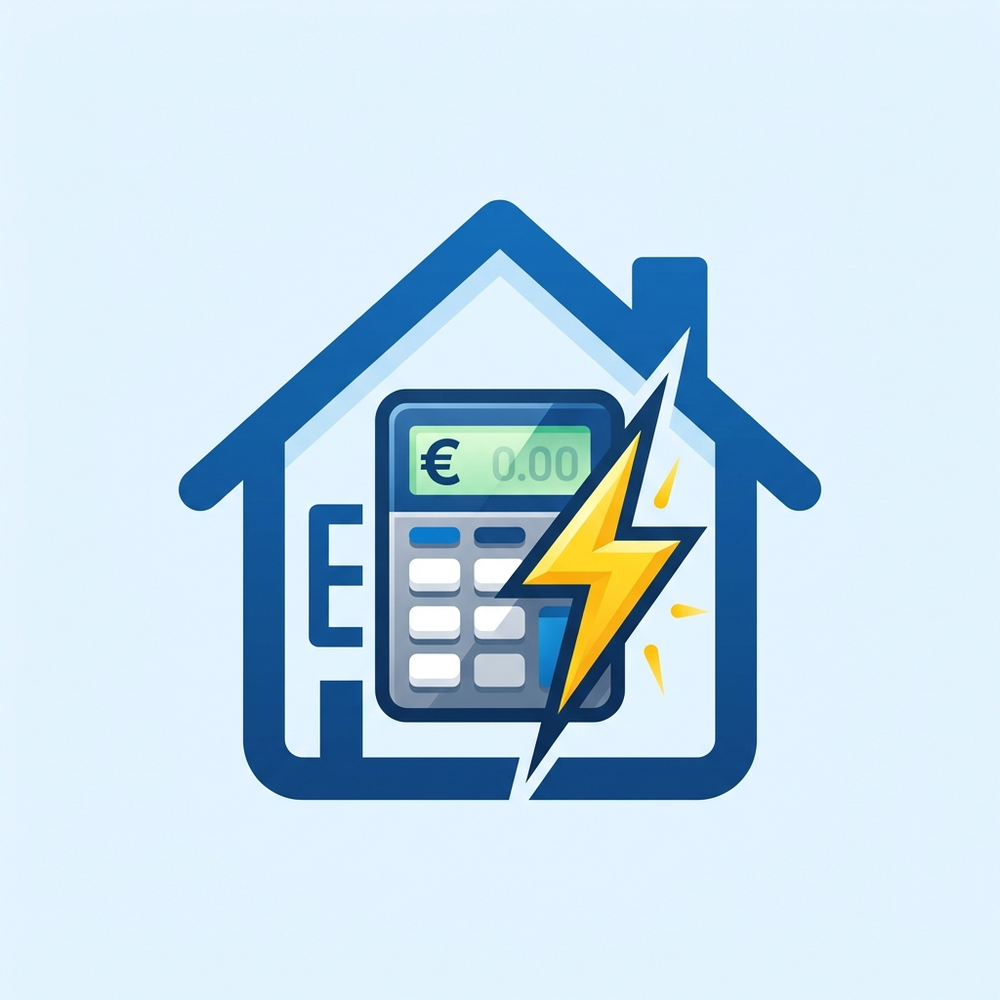
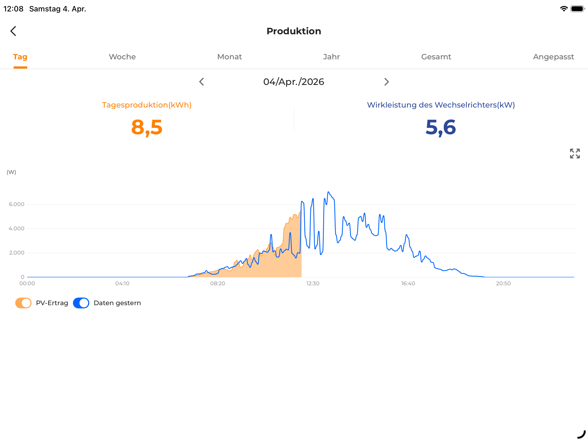
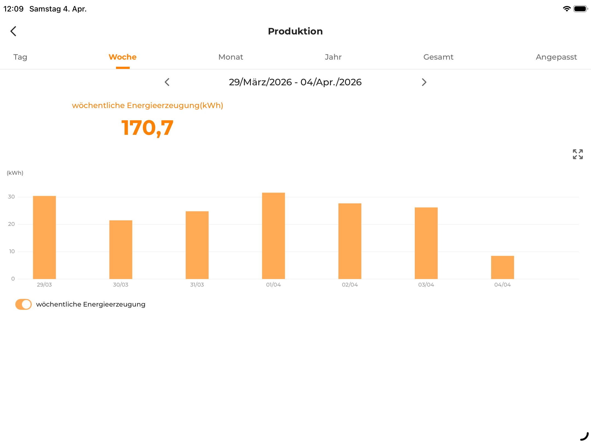
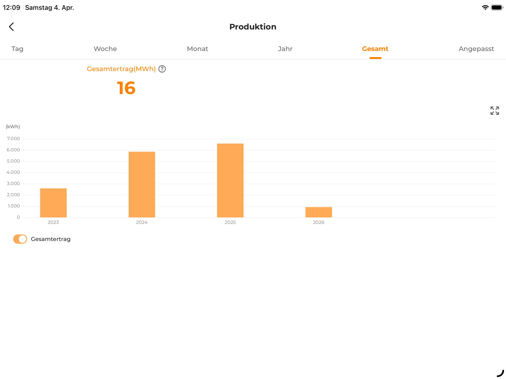

# Energierechner Home Assistant Integration

<p align="center">
  
</p>

Ein Home Assistant Port des [Energierechner Symcon Moduls](https://github.com/Schnittcher/Energierechner) zur Berechnung von Stromkosten mit dynamischen Tarifperioden, Tag-/Nachttarifen und flexibler Aggregation.

## Screenshots

<p align="center">
  
  
  
</p>

## Funktionen

- ✅ Mehrere Tarifperioden mit konfigurierbaren Preisen
- ✅ Tag-/Nachttarif-Trennung (konfigurierbare Zeiten)
- ✅ Grundpreisberechnung
- ✅ Bilanzberechnung (monatlicher Abschlag – tatsächliche Kosten)
- ✅ Zeitraum-Aggregation:
  - Täglich, Vortag
  - Wöchentlich (aktuell/vorherig)
  - Monatlich (aktuell/letzter)
  - Jährlich (aktuell/letztes)
  - Periodenweise (je Tarif)
- ✅ Flexibles Verbrauchs-/Kosten-Tracking (Tag/Nacht getrennt)
- ✅ **Neu:** PV-Einspeisung / Ertragstracking: Wähle im Setup zwischen Strombezug (Kosten/Verbrauch) und PV-Einspeisung (Vergütung/Ertrag).
- ✅ Jede Kennzahl (Kosten, Verbrauch, Bilanz) wird als **eigene physische Sensor-Entität** erstellt (optimal für Dashboards).
- ✅ Recorder-basierte Verlaufsauswertung
- ✅ Einrichtung über die **Home Assistant UI** (kein YAML nötig)

## Installation

### HACS (empfohlen)

1. HACS → Integrationen → ⋮ → **Benutzerdefinierte Repositories**
2. URL: `https://github.com/PowderK/Energierechner-HA` · Kategorie: **Integration**
3. „Energierechner" suchen und installieren
4. Home Assistant neu starten

### Manuelle Installation

1. Dieses Repository klonen
2. `custom_components/energierechner/` in das HA-Verzeichnis `config/custom_components/` kopieren
3. Home Assistant neu starten

## Einrichtung

Nach dem Neustart:

**Einstellungen → Integrationen → + Hinzufügen → „Energierechner"**

Der dreistufige Assistent führt durch:
1. **Grundkonfiguration** – Sensorname, kWh-Quelle, Aktualisierungsintervall
2. **Funktionen** – Aktivierung von Tag-/Nachttarif, Zeiträumen (heute, Woche, Monat…), Bilanz
3. **Setup-Menü (Tarifperioden)** – Hier fügst du über den Button **"+ Neue Tarifperiode anlegen"** bequem über ein Formular (Datum, Preise, Zeiten) deine Tarife hinzu. Danach auf "Speichern & Beenden" klicken.

*(Einstellungen können nachträglich jederzeit über **Konfigurieren** im selben Menü angepasst, bearbeitet oder gelöscht werden.)*

## Sensor-Entitäten & Dashboard

Die Integration erzeugt für jeden aktivierten Zeitraum separate Sensoren für **Kosten (€)** und **Verbrauch (kWh)** unterhalb eines gemeinsamen Gerätes.

*(Beispiel: Wenn der Name in der UI "Strom" lautet, heißen die Entitäten `sensor.strom_heute_kosten` und `sensor.strom_heute_verbrauch`).*

### Beispiel-Karten fürs Dashboard (Grid / Übersicht)

Hier sind zwei vorgefertigte YAML-Codes für eine schöne, getrennte Übersicht im HA-Dashboard (ersetze ggf. `energierechner` durch deinen gewählten Sensornamen). Die aktuelle Periode und die Vorperiode stehen hierbei für den direkten Vergleich (Heute vs Gestern) sofort lesbar nebeneinander.

**Kachel 1: Übersicht Verbrauch**
```yaml
type: vertical-stack
cards:
  - type: entity
    entity: sensor.energierechner_gesamtverbrauch
    name: Gesamtverbrauch
    icon: mdi:lightning-bolt
  - type: grid
    columns: 2
    square: false
    cards:
      - type: entity
        entity: sensor.energierechner_heute_verbrauch
        name: Verbrauch Heute
      - type: entity
        entity: sensor.energierechner_gestern_verbrauch
        name: Verbrauch Gestern
      - type: entity
        entity: sensor.energierechner_aktuelle_woche_verbrauch
        name: Verbrauch Diese Woche
      - type: entity
        entity: sensor.energierechner_vorherige_woche_verbrauch
        name: Verbrauch Letzte Woche
      - type: entity
        entity: sensor.energierechner_aktueller_monat_verbrauch
        name: Verbrauch Dieser Monat
      - type: entity
        entity: sensor.energierechner_letzter_monat_verbrauch
        name: Verbrauch Letzter Monat
  # Natives Balkendiagramm (Verlauf der letzten 7 Tage)
  - type: statistics-graph
    title: Verbrauch (Letzte 7 Tage)
    chart_type: bar
    period: day
    days_to_show: 7
    stat_types:
      - change
    entities:
      - sensor.energierechner_gesamtverbrauch
```

**Kachel 2: Übersicht Kosten**
```yaml
type: vertical-stack
cards:
  - type: entity
    entity: sensor.energierechner_gesamtkosten
    name: Gesamtkosten
    icon: mdi:currency-eur
  - type: grid
    columns: 2
    square: false
    cards:
      - type: entity
        entity: sensor.energierechner_heute_kosten
        name: Kosten Heute
      - type: entity
        entity: sensor.energierechner_gestern_kosten
        name: Kosten Gestern
      - type: entity
        entity: sensor.energierechner_aktuelle_woche_kosten
        name: Kosten Diese Woche
      - type: entity
        entity: sensor.energierechner_vorherige_woche_kosten
        name: Kosten Letzte Woche
      - type: entity
        entity: sensor.energierechner_aktueller_monat_kosten
        name: Kosten Dieser Monat
      - type: entity
        entity: sensor.energierechner_letzter_monat_kosten
        name: Kosten Letzter Monat
```

### 🚀 Premium Dashboard (FusionSolar Style)

Diese Beispiele nutzen die [apexcharts-card](https://github.com/RomRider/apexcharts-card) für ein hochprofessionelles Design (ähnlich Huawei FusionSolar). Für die komfortable Navigation durch Zeiträume (Pfeiltasten) empfehlen wir zusätzlich die [history-explorer-card](https://github.com/alexarch21/history-explorer-card).

#### 1. Tag (Vergleich mit Vortag)
Zeigt den heutigen Verlauf als Fläche und den gestrigen Verlauf als Linie.
*Hinweis: Nutze hierfür am besten deinen Live-Leistungssensor (W/kW).*

```yaml
type: custom:apexcharts-card
header:
  show: true
  title: Tagesverlauf (Vergleich mit Gestern)
  show_states: true
  colorize_states: true
graph_span: 24h
span:
  start: day
apex_config:
  chart: { height: 250 }
  legend: { show: true, position: bottom }
  stroke: { curve: smooth, width: 2 }
series:
  - entity: sensor.dein_wirkleistung_sensor # Ersetzen durch Leistungs-Entität
    name: Heute
    type: area
    color: '#ff9800'
    opacity: 0.3
    extend_to: now
  - entity: sensor.dein_wirkleistung_sensor
    name: Gestern
    offset: -24h
    type: line
    color: '#3498db'
    stroke_width: 2
```

#### 2. Woche (Balkendiagramm)
Für das "Durchschalten" der Wochen (Pfeiltasten) empfehlen wir die [energy-period-selector-plus](https://github.com/floris090/energy-period-selector-plus) Karte in Kombination mit `apexcharts-card`.

```yaml
type: custom:apexcharts-card
header:
  show: true
  title: Wochenübersicht
graph_span: 1w
span:
  start: week
apex_config:
  chart: { type: bar, height: 250 }
  plotOptions: { bar: { columnWidth: '70%', borderRadius: 4 } }
series:
  - entity: sensor.energierechner_gesamtverbrauch
    name: Verbrauch
    color: '#ff9800'
    group_by:
      func: diff
      duration: 1d
```

#### 3. Monat (Balkendiagramm)
```yaml
type: custom:apexcharts-card
header:
  show: true
  title: Monatsübersicht
graph_span: 1month
span:
  start: month
apex_config:
  chart: { type: bar, height: 250 }
  plotOptions: { bar: { columnWidth: '80%', borderRadius: 4 } }
series:
  - entity: sensor.energierechner_gesamtverbrauch
    name: Verbrauch
    color: '#ff9800'
    group_by:
      func: diff
      duration: 1d
```

#### 4. Jahr (12 Monate)
```yaml
type: custom:apexcharts-card
header:
  show: true
  title: Jahresübersicht
graph_span: 1y
span:
  start: year
apex_config:
  chart: { type: bar, height: 250 }
  plotOptions: { bar: { columnWidth: '70%', borderRadius: 4 } }
series:
  - entity: sensor.energierechner_gesamtverbrauch
    name: Monatsertrag
    color: '#ff9800'
    group_by:
      func: diff
      duration: 1month
```

#### 5. Gesamt (Alle Jahre nebeneinander)
Zeigt alle verfügbaren Jahre in einem Vergleichsdiamgramm.

```yaml
type: custom:apexcharts-card
header:
  show: true
  title: Gesamtübersicht (Jahresvergleich)
graph_span: 5y
span:
  end: year
apex_config:
  chart: { type: bar, height: 250 }
  plotOptions: { bar: { columnWidth: '50%', borderRadius: 4 } }
series:
  - entity: sensor.energierechner_gesamtverbrauch
    name: Jahresverbrauch
    color: '#ff9800'
    group_by:
      func: diff
      duration: 1y
```

> **Tipp für kompakte Layouts:** Wenn du die [multiple-entity-row](https://github.com/benct/lovelace-multiple-entity-row) HACS Frontend-Karte verwendest, lassen sich aktuelle Periode und Vorperiode sogar numerisch in *einer einzigen* Zeile kombinieren.

## Debugging

Debug-Logging in `configuration.yaml` aktivieren:

```yaml
logger:
  logs:
    custom_components.energierechner: debug
```

Logs ansehen: **Einstellungen → System → Protokolle**

## Voraussetzungen

- Home Assistant 2023.1 oder neuer
- Recorder-Integration aktiviert (Standard)
- Stromverbrauchs-Sensor mit kWh-Werten (z. B. von einem Energiezähler)

## Lizenz

Siehe [LICENSE](LICENSE)

## Danksagung

Originales Symcon-Modul von [Schnittcher](https://github.com/Schnittcher)

## Support

Bei Problemen oder Feature-Wünschen bitte ein [Issue](https://github.com/PowderK/Energierechner-HA/issues) erstellen.
